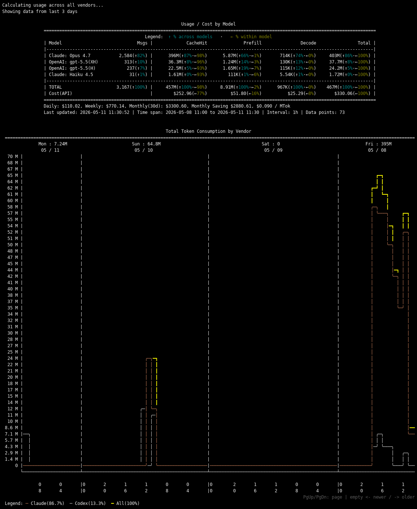

# AI Usage Monitor

A fast terminal dashboard for tracking token usage and costs across **Claude Code**, **OpenAI Codex**, and **Google Gemini CLI**. Written in Rust.



## Features

- Multi-vendor usage tracking in one place
- Per-model token breakdown with cost analysis and daily/weekly/monthly projections
- ASCII time series charts with ANSI colors
- Responsive display adapting to terminal width
- Live monitor mode with interactive keyboard controls

## Install

### Option 1: Download binary

Download the pre-built static binary from [Releases](https://github.com/shinezyy/ai-usage/releases) and place it anywhere in your `$PATH`. No dependencies required.

### Option 2: Build from source

```bash
# Standard build
cargo build --release

# Static binary (portable across x86_64 Linux)
rustup target add x86_64-unknown-linux-musl
cargo build --release --target x86_64-unknown-linux-musl
```

## Quick Start

```bash
# All vendors, last 3 days (monitor mode)
vibe-usage

# Single snapshot, then exit
vibe-usage --once

# Last 30 days, specific vendor
vibe-usage --days 30 --vendor claude
```

See [docs/usage.md](docs/usage.md) for full usage details, data sources, monitor mode controls, and configuration.

## License

MIT License - see [LICENSE](LICENSE) file.
