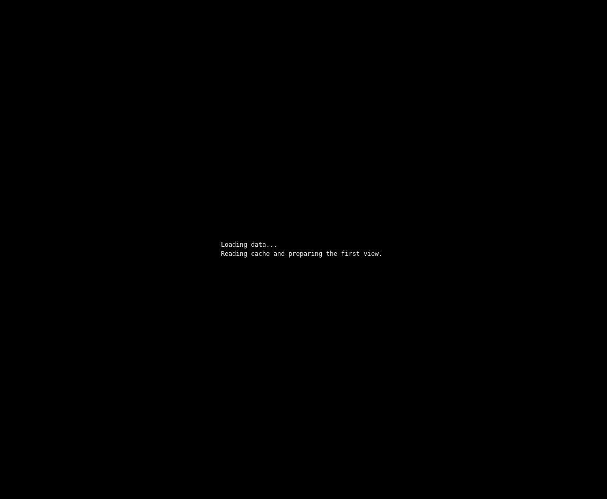

# AI Usage Monitor

A fast terminal dashboard for tracking token usage and costs across **Claude Code**, **OpenAI Codex**, **Google Gemini CLI**, **Kimi Code**, and **Oh My Pi**. Written in Rust.



## Features

- Multi-vendor usage tracking in one place
- Per-model token breakdown with cost analysis and daily/weekly/monthly projections
- ASCII time series charts with ANSI colors
- Responsive display adapting to terminal width
- Live monitor mode with interactive keyboard controls and process CPU/RSS telemetry
- Runtime monthly-cost editing with validated `.fee.env` persistence
- Versioned JSON snapshots for local integrations

## Install

### Option 1: Install and start

```bash
sh -c "$(curl -fsSL https://raw.githubusercontent.com/SihaoLiu/ai-usage/main/scripts/install.sh)"
```

The installer detects Linux x86_64, Linux aarch64, or Apple Silicon; downloads
the matching latest release; installs it to `~/.local/bin/ai-usage`; and
starts the dashboard immediately. It prints a PATH reminder when needed.

Set `AI_USAGE_INSTALL_DIR` to install elsewhere, or `AI_USAGE_VERSION` to a
specific tag such as `v3.0.0`. Once installed, type `update` in monitor mode
or use `--auto-update` for periodic self-updates.

### Option 2: Build from source

```bash
# Standard build
cargo build --release

# Static binary (portable across x86_64 Linux)
rustup target add x86_64-unknown-linux-musl
cargo build --release --target x86_64-unknown-linux-musl
```

## Quick Start

```bash
# All vendors, last 3 days (monitor mode)
ai-usage

# Single snapshot, then exit
ai-usage --once

# Last 30 days, specific tool
ai-usage --days 30 --tool claude

# Machine-readable usage for the last 7 local calendar days
ai-usage snapshot --days 7 --tool all
```

See [docs/usage.md](docs/usage.md) for full usage details, data sources, monitor mode controls, and configuration. For optional cross-machine sync, see [docs/sync.md](docs/sync.md).

## License

MIT License - see [LICENSE](LICENSE) file.
